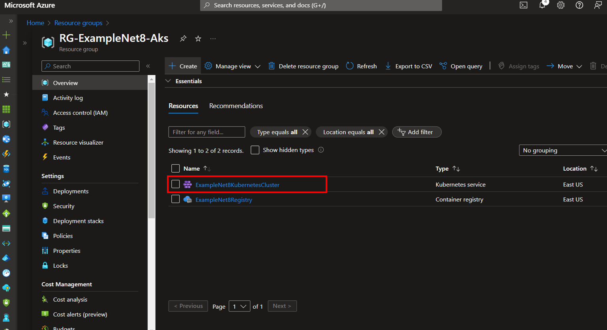
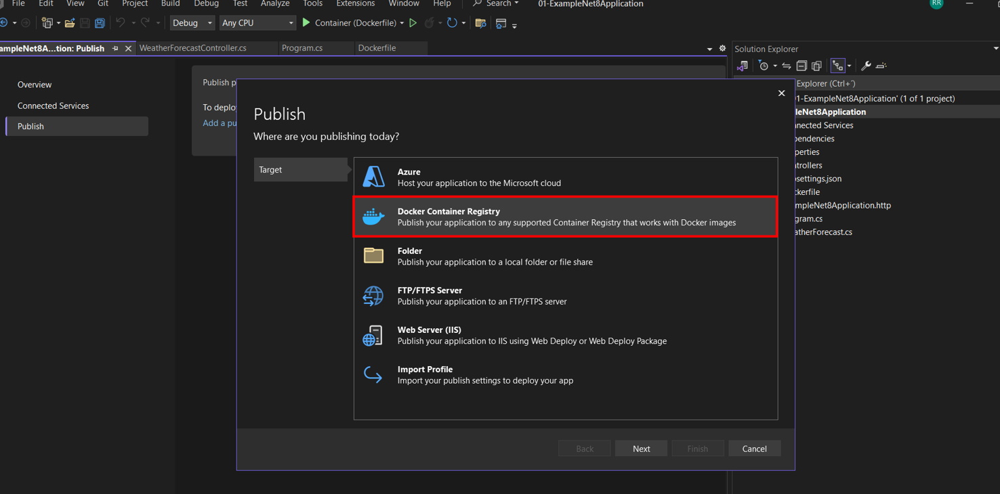
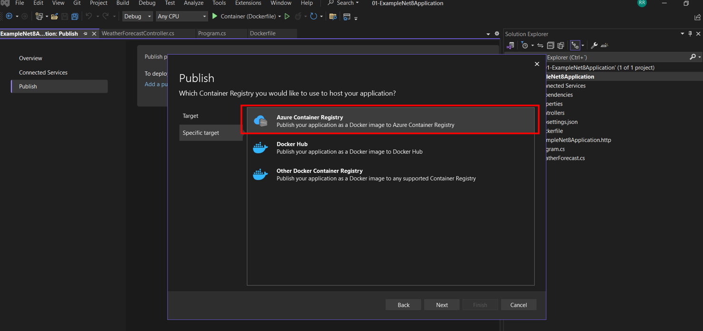
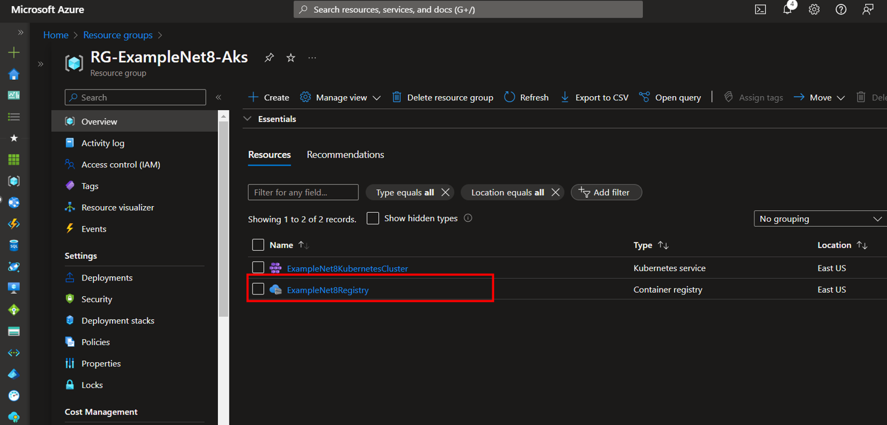

# Implementation and deploy of a Web Api .NET Core 8 in Azure Kubernetes Services (AKS)

### Steps

[1. NET Core 8 Web API](#net-core-8-web-api)

[2. Create Resource Group in Azure](#create-resource-group-in-azure)

[3. Create Container Registry in Azure](#create-container-registry-in-azure)

[4. Create Azure Kubernetes Service(AKS) in Azure](#create-azure-kubernetes-serviceaks-in-azure)

[5. Publish NET Core 8 Web API in Container Registry](#publish-net-core-8-web-api-in-container-registry)

[6. Deploy image examplenet8application in AKS](#deploy-image-examplenet8application-in-aks)

### Prerequisites
- Visual Studio 2022
- Net Core 8 SDK
- Docker Desktop
- Azure Portal Subscription

In the world of software development, we find ourselves at the stage in which we have to deploy our application. Whether on premise or on cloud, there will always be some small challenges to overcome, but there is nothing better than being prepared when that time comes. Next, we will explain how to deploy a NET Core 8 web API in AKS.(The deployment was approached under a manual approach. In an automatic approach deployment are usually handled under automated pipelines (CI/CD). In a next post we will address the automatic approach)

### NET Core 8 Web API

Create a .NET Core 8 Web API

Configure your new project

Additional information

Project created

Add Support Docker to the application **ExampleNet8Application**

**Target OS**: Linux and **Container build type**: Dockerfile 

In a few seconds we should be able to visualize the image of our **ExampleNet8Application** application in docker.

Run application with docker

Execute GET /WeatherForecast

### Create Resource Group in Azure

Login on Azure Portal and look for the resource group service.

Select create

Write a name for our resource group "**RG-ExampleNet8-Aks**". Select Review + create.

Select Create

In an instance we will see our resource group "**RG-ExampleNet8-Aks**".

### Create Container Registry in Azure

We are looking for the Container Registries service

Select create

Select our resource group **RG-ExampleNet8-Aks** and name the registry container **ExampleNet8Registry**. Select Review + create.

Select Create

In a instace we will see our container registry "**ExampleNet8Registry**"

### Create Azure Kubernetes Service(AKS) in Azure

We are looking for the Kubernetesservices service

Select Create a Kubernetes cluster

Select our resource group **RG-ExampleNet8-Aks** and name the Kubernetes cluster **ExampleNet8KubernetesCluster**. 

In the Integrations tab we select our container registry **ExampleNet8Registry**. Select Review + create

Select Create

We waited a few minutes and the headed to our resource group **RG-ExampleNet8-Aks**. We must find our aks **ExampleNet8KubernetesCluster**

### Publish NET Core 8 Web API in Container Registry
Right click on our **ExampleNet8Application** project and select Publish

Select Docker Container Registry

Select Azure Container Registry

Select the ExampleNet8Registry container registry that we created earlier

Select Docker Desktop

Select Publish

Publish Succeeded

In the Azure portal, within our resource group we select the ExampleNet8Registry container registry

Select the **Repositories** option and we can see our published imagen **examplenet8application**

Select tag latest

We see the location of our image.

### Deploy image examplenet8application in AKS
Create two yml files and place them in the root of our project

pod.yml

---

---

service.yml

---

---

Open the powershell and we are located at the root of the project. Enter az login and a tab will open in the browser to log with our Azure credentials

We go to our aks **ExampleNet8KubernetesCluster** and select connect. We enter the two commands in powershell

Enter the following command **kubectl apply -f pod.yml** to create the pod and then enter the following command **kubectl get pods** to see the status of the pod(**Status Running**)

Enter the following command **kubectl get pods** to create the service and then enter the following command **kubectl get services** to see the status of the service

In the option Services and Ingresses of ExampleNet8KubernetesCluster we can see the service **examplenet8-aks** (**Status Ok**). We click on the external ip **4.156.57.235** 

A tab will open and we add /weatherforecast to the url. We can see the result of the service

Diagram of components participating in flow

With this we have completed this deployment tutorial in Azure Aks. In a next publication we will discuss this deployment automatically and focused on a business enviroment.

Tranks and regards

